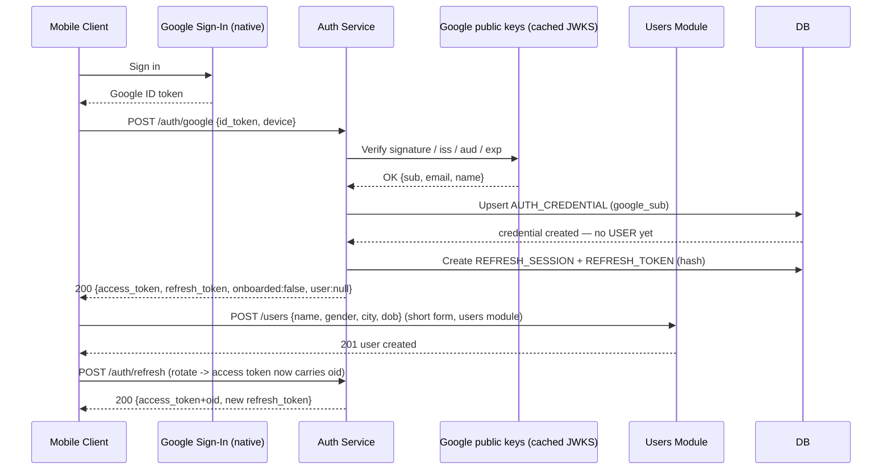
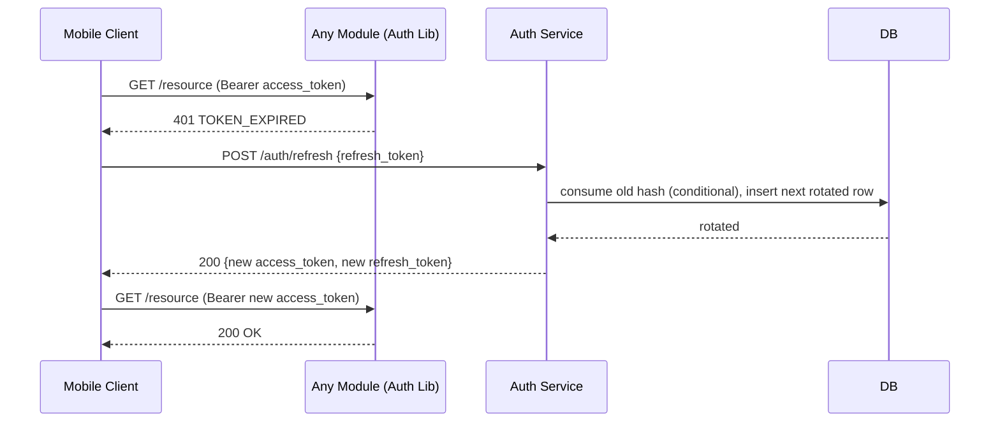
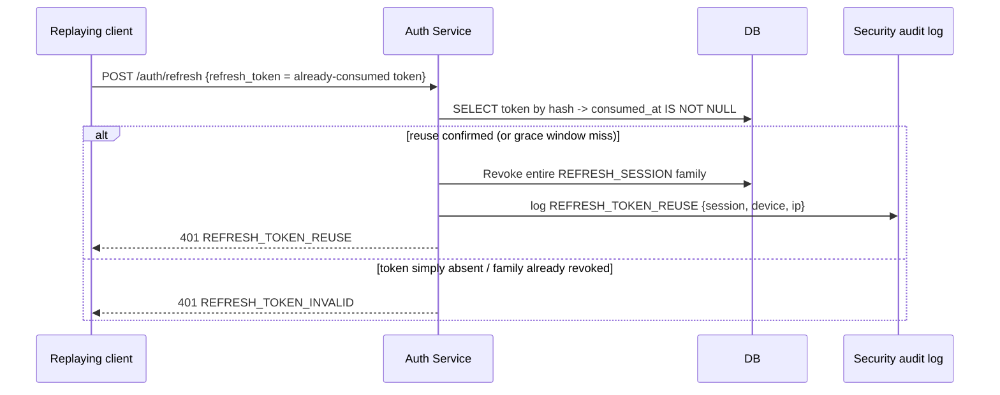
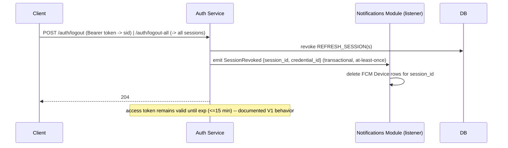

# Auth Service — API Design

Base URL: `https://api.wiingman.in/auth/api/v1` — gateway convention `{baseURL}/{service}/api/v1/{resource}`; all paths below are relative to this base (e.g. `GET https://api.wiingman.in/auth/api/v1/auth/me`) · Content-Type: `application/json` · Dates: ISO-8601 UTC · IDs: UUID

**Module:** `auth` inside the Spring Boot modulith. Owns `AUTH_CREDENTIAL` and all session/token state. It verifies Google ID tokens, issues our access + refresh tokens, and exposes our public keys. **It never owns `USER`** — profile/onboarding rows live in the `users` module (`api-design/user.md`), and `UserClient` is how other modules resolve identities.

**Verify on every request, elsewhere:** JWT validation lives in the shared kernel as **`commons.security`** (the former Auth Lib, folded into `commons` — see `commons.md` §security): stateless RS256 verification against `GET /.well-known/jwks.json` on every module. Auth Service itself is only called on the login/refresh/logout/jwks paths.

### Responsibilities

| Owns | Consumes |
|---|---|
| `AUTH_CREDENTIAL`, refresh sessions, refresh tokens (hashed), device fingerprints | Google ID-token verification (Google/Firebase public JWKS, cached) · `users` module for `USER.status` checks and `POST /users` onboarding |

---

## Table of contents

1. [Token contract](#1-token-contract)
2. [Error envelope](#2-error-envelope)
3. [POST /auth/google](#3-post-authgoogle)
4. [POST /auth/refresh](#4-post-authrefresh)
5. [POST /auth/logout · /auth/logout-all](#5-post-authlogout--authlogout-all)
6. [GET /.well-known/jwks.json](#6-get-well-knownjwksjson)
7. [GET /auth/me](#7-get-authme)
8. [Supporting: sessions](#8-supporting-session-management)
9. [Non-functional notes](#9-non-functional-notes)
10. [Sequence diagrams](#10-sequence-diagrams)

---

## 1. Token contract

### 1.1 Access token (JWT, RS256)

Signed **RS256** (RSA-2048), **statelessly verifiable** via Auth Lib with `GET /.well-known/jwks.json`. **Not revocable mid-lifetime** — the refresh token is the revocation control point; access tokens naturally expire.

**Header**
```json
{ "alg": "RS256", "typ": "JWT", "kid": "k-2026b" }
```

**Single authoritative claims table** — every module (`users`, `notifications`, `matching`, …) reads exactly these claims and no others; no module-local claims.

| Claim | Type | Always | What it identifies / notes |
|---|---|---|---|
| `iss` | string | ✅ | `https://auth.fold.app/v1` |
| `aud` | string | ✅ | `fold-mobile` |
| `sub` | string | ✅ | **permanent identity** — `AUTH_CREDENTIAL.id`, minted at first google login, never changes. Present before and after onboarding. |
| `oid` | string | ⚠️ | **`USER.id` (User Service userId)** — present only once onboarded (`onb=true`). |
| `sid` | string | ✅ | refresh session id for the session that minted this token (§1.2). Lets modules bind side-effects to a session without calling auth back. |
| `dfp` | string | ✅ | `device.fingerprint` of the minting session — lets modules cross-check device-bound requests (e.g. notification token registration). |
| `onb` | boolean | ✅ | `true` once a `USER` row exists for this identity. |
| `email` | string | ✅ | from Google, already verified by Google |
| `roles` | string[] | ✅ | default `["USER"]`; `DEV`/`ADMIN` granted by allowlist. **Staleness:** roles are a snapshot — a role change is picked up on the next `/auth/refresh` or re-login; already-issued tokens keep the old roles until `exp`, as access tokens aren't revocable (`user.md` reads `roles` from this token, so it inherits the same ≤ 15 min lag) |
| `iat` | integer | ✅ | epoch seconds |
| `exp` | integer | ✅ | epoch seconds |
| `jti` | string | ✅ | unique per token; audit/denylist (future) |

**`sub` vs `oid` — genuinely different IDs, never the same value.** `sub` is the credential (Google identity) id owned by auth; `oid` is the profile (USER) id owned by the users module. They are linked by `USER.credential_id` (plain-ID reference, `user.md`). `sub` exists from the first login; `oid` appears only after onboarding.

**`onb` lifecycle & claim staleness:** `onb` starts `false` and flips to `true` when the users module creates the `USER` row (`POST /users`). Claims are a **snapshot at mint time** — a token minted before onboarding keeps `onb=false` and no `oid` until the client refreshes (`POST /auth/refresh`, which re-resolves current state) or re-logs in. The same staleness applies to `roles` and applies in the direction `true→false` too (a restored/disabled account is only reflected after a refresh). A request authenticated with `onb=false` is legal **only** on `POST /users` (and auth's own refresh/logout); every other resource endpoint rejects it with `403 ONBOARDING_INCOMPLETE` (§2).

**Lifetime:** 15 minutes (configurable 5–30). Clock-skew tolerance: 30 s. **Used in:** `Authorization: Bearer <access_token>` on every request to every module; verified by Auth Lib (signature, `kid`, `iss`, `aud`, `exp`).

### 1.2 Refresh token (opaque)

| Property | Value |
|---|---|
| Format | opaque, 256-bit CSPRNG → 43-char base64url (`v1.<32 bytes>`), **never a JWT** |
| Storage | SHA-256 hash in DB only — plaintext never persisted; shown once in the `/auth/google` / `/auth/refresh` response |
| Lifetime | 30 days, **sliding** — each rotation re-issues `expires_at = now + 30d` |
| Rotation | every use consumes the old token and issues a new one; old is dead immediately |
| Reuse | presenting an already-consumed token ⇒ theft response (§4) |

**Server-side shape (design reference)**

```
REFRESH_SESSION   id, credential_id, user_id (null until onboarded), device{name, os, fingerprint},
                  created_at, last_used_at, expires_at, revoked_at
REFRESH_TOKEN     id, session_id, token_hash(SHA-256), issued_at, consumed_at, expires_at
```

**Sessions are a first-class concept — one `REFRESH_SESSION` per device login, never one global token.** The session is what `sid`/`dfp` claims reference and what logout revokes. `device.fingerprint` is captured at login (`POST /auth/google` request `device.fingerprint`) and copied into the `dfp` claim of every token the session mints.

**Multi-device rotation invariant:** a session owns its own chain of rotated `REFRESH_TOKEN` rows. Rotating the refresh token for session A consumes rows of session A only — session B's rows (and B's devices) are untouched. Concurrency is per-row: the conditional `UPDATE ... WHERE consumed_at IS NULL` (§4) serializes exactly one winner per token. Reuse detection works because a rotated token's row keeps `consumed_at` — presenting it again means someone replayed a token the holder already spent.

---

## 2. Error envelope

Canonical shape for **all** non-2xx responses across the whole API (auth + every other module):

```json
{
  "error": {
    "code": "TOKEN_EXPIRED",
    "message": "Access token has expired. Use POST /auth/refresh.",
    "traceId": "8f2c1a3d-...",
    "field_errors": []
  }
}
```

| Field | Type | Notes |
|---|---|---|
| `code` | string | machine-readable, stable (this doc enumerates them) |
| `message` | string | human-readable; generic wording for security-sensitive cases (no ban-state leakage) |
| `traceId` | string | correlates server logs; generated per failed request |
| `field_errors` | array | optional; `[{ "field", "message" }]` on `VALIDATION_ERROR` / `INVALID_REQUEST_BODY` only |

Every error row in every endpoint table below conforms to this envelope. Generic codes used across modules — **this is the canonical, exhaustive set; service docs reference them by name rather than repeating per-endpoint**:

| Code | Status | Notes |
|---|---|---|
| `TOKEN_MISSING` | 401 | no `Authorization` header |
| `TOKEN_MALFORMED` | 401 | header isn't a Bearer token / not a JWT |
| `TOKEN_EXPIRED` | 401 | `exp` passed (clock-skew 30 s) |
| `TOKEN_INVALID_SIGNATURE` | 401 | signature/`kid` verification failed after JWKS refresh |
| `TOKEN_INVALID_AUDIENCE` | 401 | `aud` ≠ `fold-mobile` |
| `TOKEN_UNKNOWN_KID` | 401 | signer key not in local JWKS cache; verifier refreshes once, then refuses |
| `TOKEN_REVOKED` | 401 | **reserved** — returned only once the future `jti` denylist ships; in V1 access tokens are not revocable and this code is never returned |
| `TOKEN_INVALID_CLAIMS` | 401 | structurally valid token with an inconsistent claim set (e.g. `onb=true` without `oid`) — a server-side minting defect; the only remedy is re-auth |
| `ONBOARDING_INCOMPLETE` | 403 | caller's `onb` claim is `false` — the **canonical** code services use for un-onboarded principals, instead of a generic `FORBIDDEN` |
| `TOO_MANY_REQUESTS` | 429 | handled centrally by shared infrastructure (TBD) |
| `TEMPORARY_ERROR` | 503 | |

`TOKEN_*`/`ONBOARDING_INCOMPLETE` are the **Auth Lib** verification set — every module that validates our JWT returns the same codes, so clients handle them once.

---

## 3. POST /auth/google

**Purpose:** Exchange a Google ID token for our access + refresh token pair; handles first-time signup (`onboarded=false`) and returning login in one call.

**Method + path:** `POST /api/v1/auth/google`

**Auth requirement:** none (public; this endpoint is the only public token-minting surface).

### Request

**Headers:** `Content-Type: application/json` · `Idempotency-Key` (optional, §9)

**Body — JSON example**
```json
{
  "id_token": "eyJhbGciOiJSUzI1NiIsImtpZCI6IjE...  (Google ID token from native SDK)",
  "device": {
    "name": "Pixel 9 Pro",
    "os": "android",
    "fingerprint": "iid-8f2c9a...  (per-install random id, stable)"
  }
}
```

**Field table**

| Field | Type | Req | Constraints |
|---|---|---|---|
| `id_token` | string | ✅ | Google ID token (JWT); URL-safe, ≤ 16 KB; `aud` must match this app's Google client id |
| `device.name` | string | — | ≤ 64 chars; shown in session list |
| `device.os` | string | — | `ios` \| `android` |
| `device.fingerprint` | string | ✅ | ≤ 128 chars; **captured at login, stored on the session, minted into every token's `dfp` claim**; must be stable per install — required because device-bound requests (e.g. push registration, `notifications.md`) validate against `dfp` |

### Success response

**Status 200**

**Body — JSON example (first-time user)**
```json
{
  "access_token": "eyJraWQiOiJrLTIwMjZiIiwiYWxnIjoiUlMyNTYifQ...",
  "token_type": "Bearer",
  "expires_in": 900,
  "refresh_token": "v1.d81mcQ3hH9sB2nT7gKz4LpW6yR8sQ0uV7xY2aB4cD6eF8",
  "refresh_expires_in": 2592000,
  "onboarded": false,
  "user": null
}
```

**Body — JSON example (returning user)**
```json
{
  "access_token": "eyJraWQiOiJrLTIwMjZiIiwiYWxnIjoiUlMyNTYifQ...",
  "token_type": "Bearer",
  "expires_in": 900,
  "refresh_token": "v1.a4fR7sT2wX9pQ5nL1yH3jK8cV6bN0mZ4sD6fG8hJ2kL4",
  "refresh_expires_in": 2592000,
  "onboarded": true,
  "user": { "id": "9f3a1c4e-2b7d-4a81-9c5e-8d2f0a6b3c11" }
}
```

**Field table**

| Field | Type | Notes |
|---|---|---|
| `access_token` | string | JWT (RS256, 15 min), claims §1.1 |
| `token_type` | string | always `Bearer` |
| `expires_in` | integer | seconds; use to schedule silent refresh |
| `refresh_token` | string | opaque, shown once |
| `refresh_expires_in` | integer | seconds; sliding from now |
| `onboarded` | boolean | `false` → client must run `POST /users` (users module) |
| `user` | object\|null | `null` until onboarded; then `{ id }` |

**Flow:** verify ID token (signature, `iss`, `aud`, `exp`) → upsert `AUTH_CREDENTIAL` by `google_sub` → if onboarded, check `USER.status` → create `REFRESH_SESSION` + first `REFRESH_TOKEN` (hash stored) → return pair. After the client completes `POST /users`, it calls `POST /auth/refresh` once to obtain an access token carrying `oid`.

**Status gate:** `SUSPENDED` → `403 ACCOUNT_DISABLED`. `DEACTIVATED` → **not** blocked (review fix — closes the self-deactivation dead-end): the identity re-onboards (`onboarded=false`, `user=null`) and may create a fresh `USER` via `POST /users` (`user.md` Register). `SHADOW_BANNED`/`QUEUED` sign in normally.

> A returned token does **not** guarantee a completed profile: `onboarded=false` means no `USER` row exists yet (client must call `POST /users`, `api-design/user.md` Register). Even `onboarded=true` only means a row exists — its profile fields (bio/photos) are completed independently by that service.

> **Google ID-token contents (review fix):** the ID token carries `sub` (→ `google_sub`), `name`, `email`, `picture` — **never `dob`**. `email` stays auth-owned; `name` + `dob` travel to the users module via `POST /users`.

### Errors

| Status | Code | Message |
|---|---|---|
| 400 | `INVALID_REQUEST_BODY` | `Malformed JSON body.` |
| 422 | `VALIDATION_ERROR` | `id_token is required.` (+ `field_errors`) |
| 401 | `GOOGLE_TOKEN_MALFORMED` | `Provided token is not a valid Google ID token.` |
| 401 | `GOOGLE_TOKEN_EXPIRED` | `Google ID token has expired.` |
| 401 | `GOOGLE_TOKEN_INVALID_SIGNATURE` | `Google ID token signature could not be verified.` |
| 401 | `GOOGLE_TOKEN_AUDIENCE_MISMATCH` | `Google ID token was issued for a different app.` |
| 503 | `GOOGLE_VERIFICATION_UNAVAILABLE` | `Google sign-in is temporarily unavailable. Retry shortly.` |
| 403 | `ACCOUNT_DISABLED` | `Account is disabled. Contact support.` (returned for `USER.status` `SUSPENDED` only — a `DEACTIVATED` identity re-onboards fresh, see Flow. Generic message on purpose; `SHADOW_BANNED` and `QUEUED` still sign in.) |
| 429 | `TOO_MANY_REQUESTS` | `Too many attempts. Try again later.` |

Omitted scenarios resolve to: DB/verifier infrastructure failure → `503 TEMPORARY_ERROR`.

---

## 4. POST /auth/refresh

**Purpose:** Rotation — exchange a valid refresh token for a new access + refresh pair. The only place access tokens are minted after login.

**Method + path:** `POST /api/v1/auth/refresh`

**Auth requirement:** none (refresh token travels in the body, see §1.2 — never in a header).

### Request

**Headers:** `Content-Type: application/json`

**Body — JSON example**
```json
{
  "refresh_token": "v1.d81mcQ3hH9sB2nT7gKz4LpW6yR8sQ0uV7xY2aB4cD6eF8",
  "device": { "name": "Pixel 9 Pro", "os": "android", "fingerprint": "iid-8f2c9a..." }
}
```

**Field table**

| Field | Type | Req | Constraints |
|---|---|---|---|
| `refresh_token` | string | ✅ | opaque (§1.2); length 43 ± a few chars |
| `device` | object | — | same as §3; updates `last_used_at` + device label |

### Success response

**Status 200** — same shape/fields as §3 (both tokens rotated; `onboarded`/`user` filled in from the current record).

```json
{
  "access_token": "eyJraWQiOiJrLTIwMjZiIiwiYWxnIjoiUlMyNTYifQ...",
  "token_type": "Bearer",
  "expires_in": 900,
  "refresh_token": "v1.z8mK2xT5pN7wQ4cL9yH3jF6sD1gH6bV0mK4nB8xJ4pR2",
  "refresh_expires_in": 2592000,
  "onboarded": true,
  "user": { "id": "9f3a1c4e-2b7d-4a81-9c5e-8d2f0a6b3c11" }
}
```

**Rotation mechanics (atomic):** single DB transaction — `UPDATE REFRESH_TOKEN SET consumed_at=NOW() WHERE token_hash=:h AND consumed_at IS NULL`; if 0 rows mutated, fall to reuse detection; else insert next rotated row, resolve credential/user, mint new tokens. Concurrent use of the same token: one transaction wins; the loser hits the reuse branch below.

### Errors

| Status | Code | Message |
|---|---|---|
| 400 | `INVALID_REQUEST_BODY` | `Malformed JSON body.` |
| 422 | `VALIDATION_ERROR` | `refresh_token is required.` |
| 401 | `REFRESH_TOKEN_INVALID` | `Session is invalid. Please sign in again.` (unknown token, malformed shape, family already revoked, or credential deleted) |
| 401 | `REFRESH_TOKEN_EXPIRED` | `Session has expired. Please sign in again.` (30 d idle/sliding expir) |
| 401 | `REFRESH_TOKEN_REUSE` | `Session was revoked for security. Please sign in again.` — **reuse detected**: a consumed token was presented again. The server revokes the **entire session family** (§1.2) and writes a security-audit event **before** responding. This path covers both genuine theft and the refresh race (§9). |
| 403 | `ACCOUNT_DISABLED` | `Account is disabled. Contact support.` |
| 429 | `TOO_MANY_REQUESTS` | `Too many refresh attempts. Please sign in again.` |
| 503 | `TEMPORARY_ERROR` | `Service temporarily unavailable. Retry shortly.` |

---

## 5. POST /auth/logout · POST /auth/logout-all

**Purpose:** Revoke sessions. `POST /auth/logout` revokes the **one** session identified by the caller's own token (`sid`). `POST /auth/logout-all` revokes **every** session for the credential (`sub`). Access tokens are not touched — they expire naturally (§1.1). Each revoked session emits a `SessionRevoked` event (§9.5).

**Auth requirement:** both require `Authorization: Bearer <access_token>` — the session id comes from the verified token's `sid` claim, so logout works even mid-refresh-rotation (the `sid` is stable across rotations). If the access token has expired, the client refreshes first (`POST /auth/refresh`) to obtain a fresh token carrying `sid`.

### 5.1 `POST /api/v1/auth/logout`

**Request:** headers `Authorization: Bearer <access_token>` · `Content-Type: application/json` — **no body** (revoked session = token's `sid`).

**Response 204** — no body. Idempotent and anti-enumeration: the session always exists (it minted the verified token), so there is nothing to probe.

| Status | Code |
|---|---|
| — | shared Auth Lib set (§2) — token invalid/expired → refresh + retry |
| 429 | `TOO_MANY_REQUESTS` |

### 5.2 `POST /api/v1/auth/logout-all`

**Request:** headers `Authorization: Bearer <access_token>` — **no body** (all sessions of the credential = token's `sub`).

**Response 204** — no body. Emits one `SessionRevoked(session_id, credential_id)` **per** revoked session.

| Status | Code |
|---|---|
| — | shared Auth Lib set (§2) |
| 429 | `TOO_MANY_REQUESTS` |

> **Migration note (breaking from earlier draft):** the earlier refresh-token-in-body + `scope` design is replaced by the Bearer/`sid` model above. Rationale: `sid` is stable and token-carried, so no plaintext refresh token needs to travel to the logout route, and single- vs all-session semantics become two explicit endpoints instead of a scope flag.

---

## 6. GET /.well-known/jwks.json

**Purpose:** Publish the RSA public keys that verify our JWTs. Auth Lib fetches (and caches) these to validate access tokens **without** calling Auth Service.

**Method + path:** `GET /.well-known/jwks.json` (public path via the gateway: `/auth/.well-known/jwks.json` — deliberate exception to the `{service}/api/v1/{resource}` convention: `.well-known` URIs sit directly under the service prefix, with no `/api/v1` segment)

**Auth requirement:** none.

### Request

No headers beyond the standard GET; no body.

### Success response

**Status 200** · `Content-Type: application/json` · `Cache-Control: public, max-age=3600`

```json
{
  "keys": [
    {
      "kty": "RSA",
      "kid": "k-2026b",
      "use": "sig",
      "alg": "RS256",
      "n": "0vx7ago... base64url modulus",
      "e": "AQAB"
    },
    {
      "kty": "RSA",
      "kid": "k-2026a",
      "use": "sig",
      "alg": "RS256",
      "n": "9f2z4aho...",
      "e": "AQAB"
    }
  ]
}
```

**Field table (`keys[]`)**

| Field | Type | Notes |
|---|---|---|
| `kid` | string | matches JWT header `kid` |
| `kty` | string | `RSA` |
| `use` | string | `sig` |
| `alg` | string | `RS256` |
| `n` | string | base64url modulus |
| `e` | string | `AQAB` |

Multiple `kid`s = rotation overlap (§9.3). Consumers **must** pick by `kid`, never assume a single key.

### Errors

| Status | Code | Message |
|---|---|---|
| 500 | `KEY_UNREACHABLE` | `No signing keys configured.` (no local key material) |
| 429 | `TOO_MANY_REQUESTS` | `Too many requests. Try again later.` |

---

## 7. GET /auth/me

**Purpose:** Return the identity encoded in the caller's access token — sanity-check for clients/debugging, and the canonical "who am I" response.

**Method + path:** `GET /api/v1/auth/me`

**Auth requirement:** `Authorization: Bearer <access_token>` (verified by Auth Lib against JWKS §6).

### Request

**Headers:** `Authorization: Bearer <access_token>` — no body.

### Success response

**Status 200**

```json
{
  "sub": "3f8c2a11-5b6d-4c7e-9f0a-b1c2d3e4f5a6b",
  "oid": "9f3a1c4e-2b7d-4a81-9c5e-8d2f0a6b3c11",
  "email": "rohan@gmail.com",
  "onboarded": true,
  "roles": ["USER"],
  "expires_at": "2026-08-30T10:15:00Z"
}
```

**Field table**

| Field | Type | Notes |
|---|---|---|
| `sub` | string | credential id (§1.1) |
| `oid` | string\|null | user id; `null` pre-onboarding |
| `email` | string | from token claims |
| `onboarded` | boolean | from `onb` claim |
| `roles` | string[] | from claims |
| `expires_at` | ISO-8601 | when the presented access token lapses |

### Errors

All from the shared Auth Lib set (§2):

| Status | Code | Message |
|---|---|---|
| 401 | `TOKEN_MISSING` | `Missing Authorization header.` |
| 401 | `TOKEN_MALFORMED` | `Authorization header is not a valid Bearer token.` |
| 401 | `TOKEN_EXPIRED` | `Access token has expired. Use POST /auth/refresh.` |
| 401 | `TOKEN_INVALID_SIGNATURE` | `Access token could not be verified.` |
| 401 | `TOKEN_INVALID_AUDIENCE` | `Access token was issued for a different audience.` |
| 401 | `TOKEN_UNKNOWN_KID` | `Unknown signing key. Retry after refreshing keys.` |
| 429 | `TOO_MANY_REQUESTS` | `Too many requests. Try again later.` |

---

## 8. Supporting: session management

Justification: the refresh token is single-use, so the client **cannot** manage other sessions through §4/§5. To power a "logged-in devices" screen and true "logout everywhere," a bearer-authenticated view over your own sessions is required. Two low-cost endpoints:

### 8.1 GET /auth/sessions

**Purpose:** List the caller's active sessions (devices). **Auth:** Bearer access token.

**Response 200**
```json
{
  "items": [
    {
      "id": "4c1f9a2e-6b8d-4a7f-9d0c-e1f2a3b4c5d7e",
      "device": { "name": "Pixel 9 Pro", "os": "android" },
      "created_at": "2026-08-29T10:00:00Z",
      "last_used_at": "2026-08-30T09:58:00Z",
      "expires_at": "2026-09-28T10:00:00Z",
      "current": true
    }
  ],
  "page": 0,
  "size": 20,
  "total": 1
}
```

`current` marks the session that minted the presented access token — exactly the token's `sid` claim (no `jti` linkage needed). Errors: the shared Auth Lib set (§2) + `429`.

### 8.2 DELETE /auth/sessions/{sessionId}

**Purpose:** Revoke one of the caller's sessions (e.g., from the devices screen). **Auth:** Bearer access token.

**Response 204** — no body. Only sessions belonging to the principal's `credential_id` are touchable; anything else → 404 (no leak that it exists). Errors: Auth Lib set (§2), `404 NOT_FOUND`, `429`.

---

## 9. Non-functional notes

### 9.1 Rate limiting

Rate limiting is a cross-cutting concern handled by shared infrastructure, not implemented per-endpoint here — mechanism TBD (same placeholder policy as `ratio.md`/`analytics.md`). Security note preserved: when central throttling lands, throttled refresh attempts must **not** trigger reuse detection (they're filtered before the token is touched).

### 9.2 Idempotency

| Endpoint | Behavior |
|---|---|
| `POST /auth/google` | **Not** inherently idempotent (mints a new session). Client SHOULD send `Idempotency-Key` (header); the replay cache is keyed on **`(verified google_sub, Idempotency-Key)`** — never the header alone (a header-only key would let a replay under a different verified identity receive someone else's refresh token). Issued `(refresh_token, session)` kept ≤ 5 min; a replay under a different identity is treated as a new request. |
| `POST /auth/refresh` | **Never auto-retry after the request is sent.** Rotation is single-use; a retry presents a consumed token and trips `REFRESH_TOKEN_REUSE`. Client rule: retry only if the request definitively never reached the server (transport error < 15 s and no response), and accept that even then a race can force a re-login. |
| `POST /auth/logout` | Idempotent by design (§5) — always 204. |
| `GET *.well-known/jwks.json` | Cacheable (`max-age=3600`); harmless to refresh on `TOKEN_UNKNOWN_KID`. |

### 9.3 Key rotation (JWKS)

- Two active `kid`s at all times during a rotation: new key is authoritatively signed from now; the previous one stays served for 14 days so tokens minted just before the switch keep verifying.
- Sequence: generate new pair → add its `kid` to the JWKS → switch issuer to it → 14 days later drop the old `kid`.
- Unknown `kid` at a verifier → `401 TOKEN_UNKNOWN_KID` → verifier refreshes JWKS once and retries the request once; still unknown → surface `TOKEN_INVALID_SIGNATURE`.
- Rotation is automatic (configurable schedule); both keys live in the auth module's key store, private key never leaves it.

### 9.4 Logout vs logout-everywhere

| | `POST /auth/logout` (single) | `POST /auth/logout-all` (everywhere) |
|---|---|---|
| Revokes | the one `REFRESH_SESSION` whose id = the token's `sid` | every `REFRESH_SESSION` for the credential (`sub`) |
| Also exposed per-device via | `DELETE /auth/sessions/{sessionId}` (§8.2) | `POST /auth/logout-all` |
| Access tokens | **still valid until `exp` (≤ 15 min)** in both cases — V1 accepts this; a `jti` denylist at the edge is the future mitigation (out of scope) |

**Downstream cleanup:** both endpoints emit `SessionRevoked` (§9.5) with payload `{ "session_id", "credential_id" }` per revoked session. Consumers react — e.g. `notifications` (`api-design/notifications.md`) deletes FCM devices bound to that session id so logout actually stops push, without any module calling auth back.

### 9.5 Transactional event publication (mechanism)

All outbound domain events — including `SessionRevoked` — are published through **Spring Modulith's transactional event publication**: `applicationEventPublisher.publishEvent(...)` inside the same DB transaction that performs the change + `@ApplicationModuleListener` subscribers on the consuming module.

- **At-least-once, retried:** the Modulith event-publication registry keeps an outbox row per event; if the listener fails (e.g. Notification Service is down mid-delete), the event is retried until the listener succeeds or the event is explicitly discarded. A dropped `SessionRevoked` would leave a logged-out device receiving pushes — this guarantee exists precisely to prevent that.
- **Contract:** event name `SessionRevoked`, payload `{ "session_id", "credential_id" }` (snake_case, JSON). Consistent inside the modulith today and over the same broker after extraction.
- **Also emitted:** `CredentialUpserted { credential_id, email }` on every login (idempotent upsert event) — modules project email locally instead of calling auth back (consumed by `notifications.md` for email-bound jobs; review fix — replaces the contradicting "Auth Lib credential lookup").

### 9.6 Reuse-detection policy (theft model)

Presenting any `REFRESH_TOKEN` row whose `consumed_at` is set → family-wide revocation + security audit event + `401 REFRESH_TOKEN_REUSE`. This deliberately treats the two-client refresh race as theft (fail-safe). A configurable `reuse_grace_ms` (default 60 s) mitigates blameless races: within the window, a presenter matching the session's device fingerprint gets `401 REFRESH_TOKEN_INVALID` (family **not** revoked, no audit event) instead of family revocation — the client must re-login either way, but a legitimately racing second device isn't chain-revoked. Off by default until traffic patterns are known.

---

## 10. Sequence diagrams

### 10.1 First-time login via Google



### 10.2 Access-token expiry → silent refresh



### 10.3 Refresh-token reuse (theft)



### 10.4 Logout



---

## Appendix A — integration contract with the users module

Auth never writes `USER`. The one seam: `POST /auth/google` returns `onboarded:false` + a token whose `sub` is the credential id and `oid` absent; the client then calls users-module `POST /users` (Bearer same token) to create the profile, and finally `POST /auth/refresh` once so every subsequent call carries `oid` in the access token. That refresh is guaranteed to work because the refresh token is bound to the credential, not the (not-yet-existing) user row.