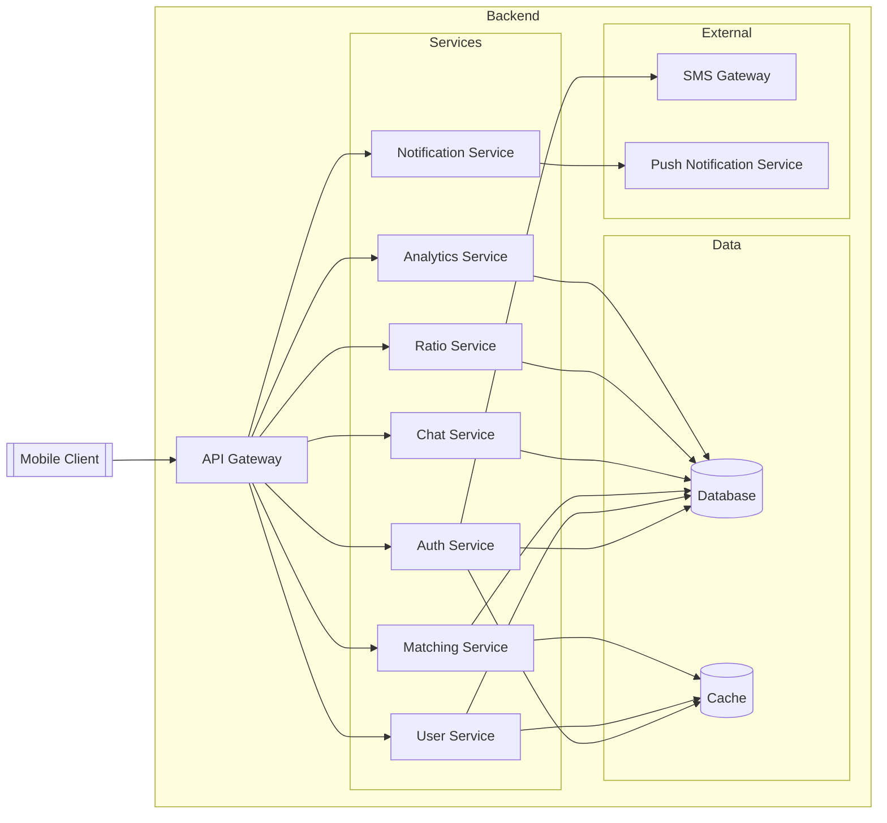

```mermaid
graph LR
    Client[[Mobile Client]]
    
    subgraph Backend
        API[API Gateway]
        
        subgraph Services
            AuthService[Auth Service]
            UserService[User Service]
            MatchingService[Matching Service]
            ChatService[Chat Service]
            RatioService[Ratio Service]
            NotificationService[Notification Service]
            AnalyticsService[Analytics Service]
        end
        
        subgraph Data
            DB[(Database)]
            Cache[(Cache)]
        end
        
        subgraph External
            SMS[SMS Gateway]
            Push[Push Notification Service]
        end
    end
    
    Client --> API
    
    API --> AuthService
    API --> UserService
    API --> MatchingService
    API --> ChatService
    API --> RatioService
    API --> NotificationService
    API --> AnalyticsService
    
    AuthService --> DB
    UserService --> DB
    MatchingService --> DB
    ChatService --> DB
    RatioService --> DB
    AnalyticsService --> DB
    
    AuthService --> Cache
    UserService --> Cache
    MatchingService --> Cache
    
    NotificationService --> Push
    AuthService --> SMS
```