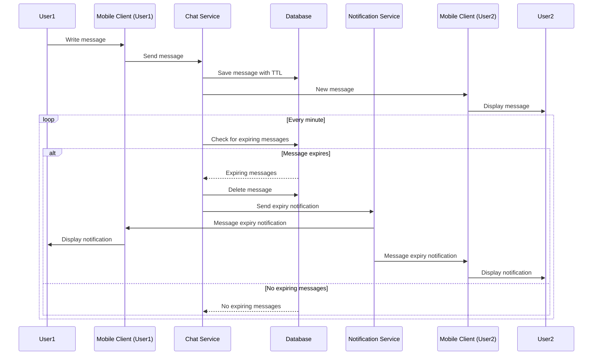

```mermaid
sequenceDiagram
    participant User1 as User1
    participant Client1 as Mobile Client (User1)
    participant Chat as Chat Service
    participant DB as Database
    participant Notif as Notification Service
    participant Client2 as Mobile Client (User2)
    participant User2 as User2

    User1 ->> Client1: Write message
    Client1 ->> Chat: Send message
    Chat ->> DB: Save message with TTL
    Chat ->> Client2: New message
    Client2 ->> User2: Display message
    loop Every minute
        Chat ->> DB: Check for expiring messages
        alt Message expires
            DB -->> Chat: Expiring messages
            Chat ->> DB: Delete message
            Chat ->> Notif: Send expiry notification
            Notif ->> Client1: Message expiry notification
            Client1 ->> User1: Display notification
            Notif ->> Client2: Message expiry notification 
            Client2 ->> User2: Display notification
        else No expiring messages
            DB -->> Chat: No expiring messages
        end
    end
```