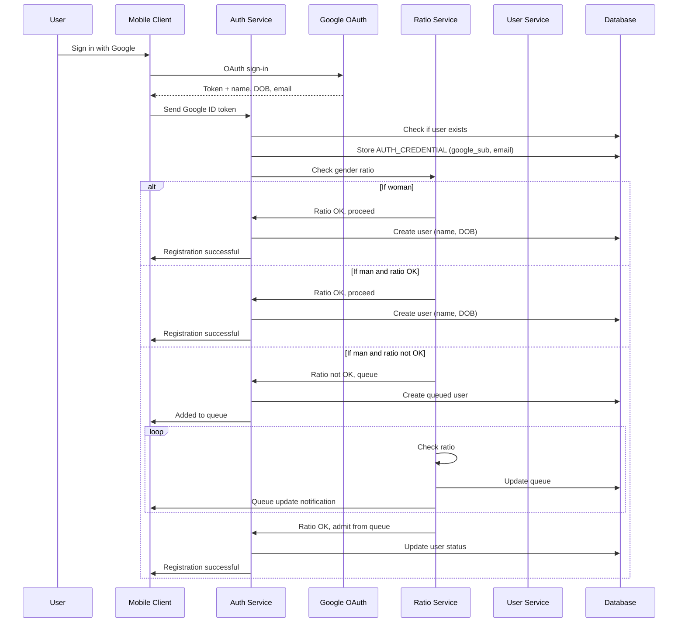

```mermaid
sequenceDiagram
    participant User as User
    participant Client as Mobile Client
    participant Auth as Auth Service
    participant Google as Google OAuth
    participant Ratio as Ratio Service
    participant UserSvc as User Service
    participant DB as Database

    User ->> Client: Sign in with Google
    Client ->> Google: OAuth sign-in
    Google -->> Client: Token + name, DOB, email
    Client ->> Auth: Send Google ID token
    Auth ->> DB: Check if user exists
    Auth ->> DB: Store AUTH_CREDENTIAL (google_sub, email)
    Auth ->> Ratio: Check gender ratio
    alt If woman
        Ratio ->> Auth: Ratio OK, proceed
        Auth ->> DB: Create user (name, DOB)
        Auth ->> Client: Registration successful
    else If man and ratio OK
        Ratio ->> Auth: Ratio OK, proceed
        Auth ->> DB: Create user (name, DOB)
        Auth ->> Client: Registration successful
    else If man and ratio not OK
        Ratio ->> Auth: Ratio not OK, queue
        Auth ->> DB: Create queued user
        Auth ->> Client: Added to queue
        loop
            Ratio ->> Ratio: Check ratio
            Ratio ->> DB: Update queue
            Ratio ->> Client: Queue update notification
        end
        Ratio ->> Auth: Ratio OK, admit from queue
        Auth ->> DB: Update user status
        Auth ->> Client: Registration successful
    end
```