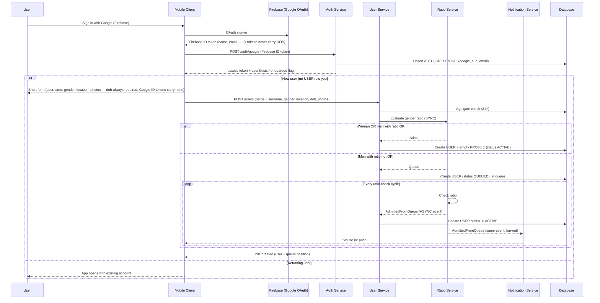

```mermaid
sequenceDiagram
    participant User as User
    participant Client as Mobile Client
    participant Firebase as Firebase (Google OAuth)
    participant Auth as Auth Service
    participant UserSvc as User Service
    participant Ratio as Ratio Service
    participant Notif as Notification Service
    participant DB as Database

    User ->> Client: Sign in with Google (Firebase)
    Client ->> Firebase: OAuth sign-in
    Firebase -->> Client: Firebase ID token (name, email — ID tokens never carry DOB)
    Client ->> Auth: POST /auth/google (Firebase ID token)
    Auth ->> DB: Upsert AUTH_CREDENTIAL (google_sub, email)
    Auth -->> Client: access token + userExists / onboarded flag

    alt New user (no USER row yet)
        Client ->> User: Short form (username, gender, location, photos — dob always required, Google ID tokens carry none)
        Client ->> UserSvc: POST /users (name, username, gender, location, dob, photos)
        UserSvc ->> DB: Age gate check (21+)
        UserSvc ->> Ratio: Evaluate gender ratio (SYNC)
        alt Woman OR man with ratio OK
            Ratio -->> UserSvc: Admit
            UserSvc ->> DB: Create USER + empty PROFILE (status ACTIVE)
        else Man with ratio not OK
            Ratio -->> UserSvc: Queue
            UserSvc ->> DB: Create USER (status QUEUED), enqueue
            loop Every ratio check cycle
                Ratio ->> Ratio: Check ratio
                Ratio -->> UserSvc: AdmittedFromQueue (ASYNC event)
                UserSvc ->> DB: Update USER status -> ACTIVE
                Ratio -->> Notif: AdmittedFromQueue (same event, fan-out)
                Notif -->> Client: "You're in" push
            end
        end
        UserSvc -->> Client: 201 created (user + queue position)
    else Returning user
        Client -->> User: App opens with existing account
    end
```