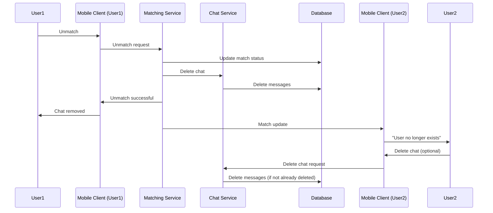

```mermaid
sequenceDiagram
    participant User1 as User1
    participant Client1 as Mobile Client (User1)
    participant Matching as Matching Service
    participant Chat as Chat Service  
    participant DB as Database
    participant Client2 as Mobile Client (User2)
    participant User2 as User2

    User1 ->> Client1: Unmatch
    Client1 ->> Matching: Unmatch request
    Matching ->> DB: Update match status
    Matching ->> Chat: Delete chat
    Chat ->> DB: Delete messages
    Matching ->> Client1: Unmatch successful
    Client1 ->> User1: Chat removed
    Matching ->> Client2: Match update
    Client2 ->> User2: "User no longer exists"
    User2 ->> Client2: Delete chat (optional)
    Client2 ->> Chat: Delete chat request
    Chat ->> DB: Delete messages (if not already deleted)
```