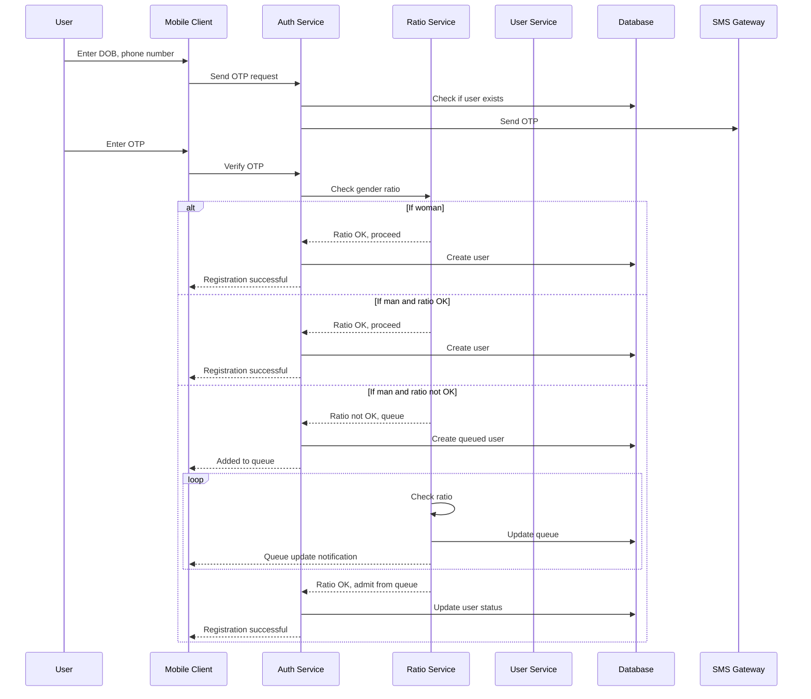
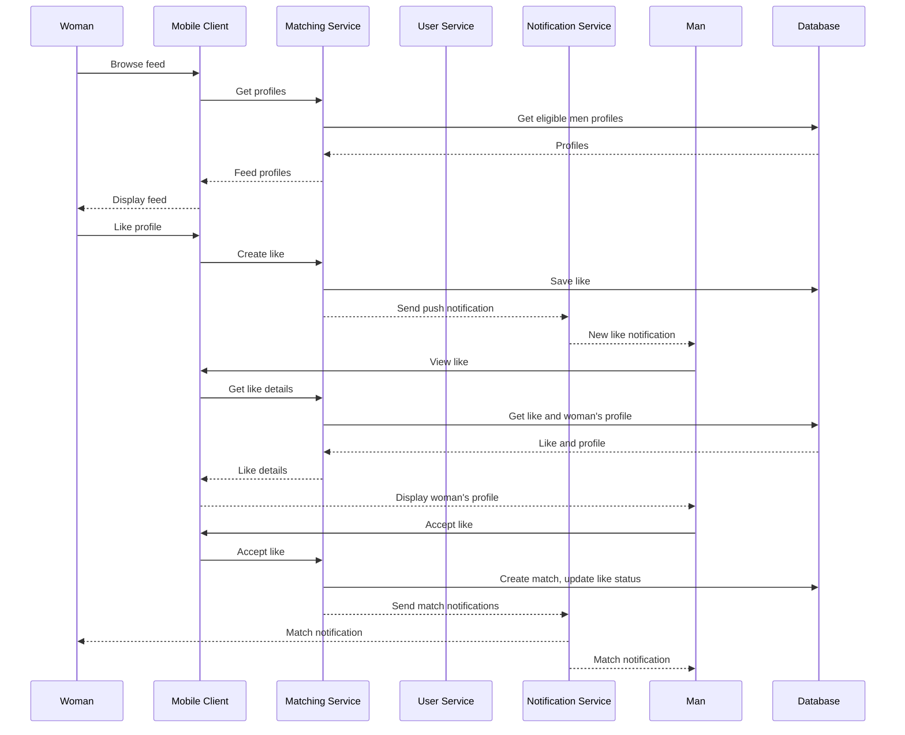
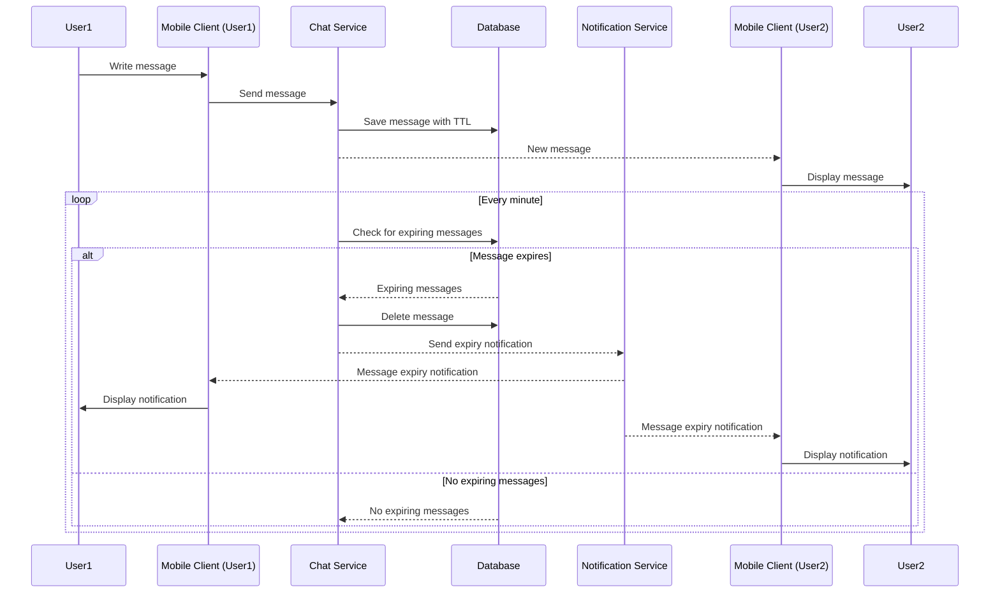
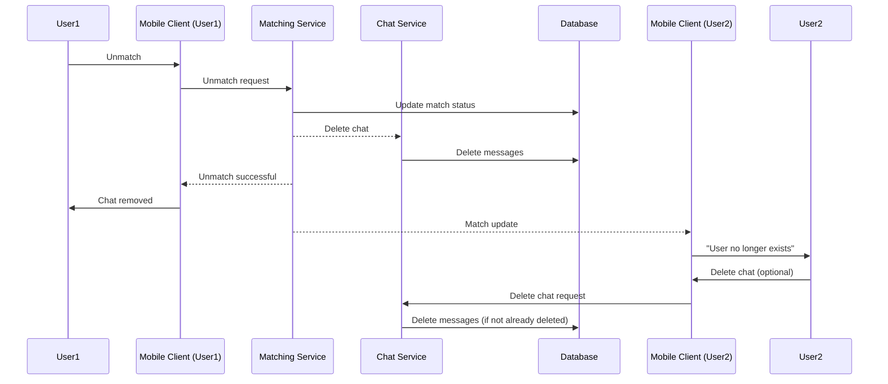

# Inter-Service Communication — Design Decision

**Scope:** how services talk to each other in the four core flows — registration, like & match, chat, unmatch (`core-flow/*.md`).

**Status:** aligns with the modulith rules in `backend/CLAUDE.md`. Service names below follow the core-flow docs; §2 maps them to the backend's actual modules.

---

## 1. Communication model — two channels

Every interaction between two services is **either synchronous or asynchronous**, by intent, and the choice maps directly onto how the app is (and can later be) deployed.

| Channel | What it means | Mechanism in the modulith | Mechanism after extraction to microservices |
|---|---|---|---|
| **SYNC** — "I need the answer now to proceed" | Caller blocks until the producer returns a value | **Client interface owned by the caller**, backed by a direct in-process call into the producer module's public API (`InProcessUserClient` today) | Same interface, new `HttpUserClient` impl — swapped via Spring profile/config, callers unchanged |
| **ASYNC** — "Something happened, others may react independently" | Fire-and-forget event; producer does not wait | Standard **Spring application event** (`@ApplicationModuleListener`, backed by the Modulith event-publication registry so events survive restarts) | Same publish call, externalized via the Modulith **outbox** to a broker (Kafka/RabbitMQ) |
| **CLIENT** (context only) | Mobile client → service over HTTP/WebSocket | Not an inter-service channel | n/a |
| **DB** (context only) | A service reading/writing the shared Postgres | Single datasource, module-owned tables (rule 7) | Separate DB per service |

**Rule of thumb for choosing:** if the caller's own logic cannot continue without the answer → **SYNC**. If the producer merely announces something and other services react on their own schedule → **ASYNC**.

---

## 2. Service ↔ module mapping

The core-flow docs name *services*; the backend implements them as *modules* in one deployable. `inter-service` = `inter-module` here.

| Core-flow service | Backend module | Notes |
|---|---|---|
| Auth Service | `auth` | Infrastructure, not a peer domain: sits in front of every request, resolves principal (userId + roles). **Not an event participant; modules never call it back.** |
| User Service | `users` | ONE source of truth for `User`. Holds account state + settings. |
| Chat Service | `messaging` | Conversations + messages. Name differs from the flow docs. |
| Matching Service | `matching` | Swipes, likes, match records, match algorithm. |
| Notification Service | `notifications` | Push delivery via external FCM; email/SMS later. |
| Ratio Service | `ratio` **(new module)** | Gender-ratio gate + waiting queue from `reg-flow`. **Decision: dedicated `ratio` module** — sync admission calls from auth, async queue events outward. |
| *(not in flows)* | `profile` | Bio/photos/prompts — needed by like/match feed and like-details reads; absent from flow diagrams, see §7.3. |
| *(not in flows)* | `discovery` | Feeds the woman's deck; owns the event-fed candidate pool, see §7.2. |
| *(not in flows)* | `commons` | Shared DTO contracts only — payloads for both sync returns and event records. |
| Database | Single Postgres | One datasource; each module owns its own tables; cross-module references are plain IDs. |
| SMS Gateway / FCM | External | Out of module boundaries: Firebase Auth (OTP), FCM (push), Firebase Storage. |

---

## 3. Channel classification guide

| Situation | Channel |
|---|---|
| Caller can't proceed without the answer — e.g. admission gate, a profile read the user's action depends on | **SYNC** (client interface) |
| Something happened, others react independently — like received, match created, message expiry | **ASYNC** (domain event) |
| One-off read that must be fresh, low volume | **SYNC** via `commons` DTO |
| High-frequency read, staleness-tolerant — e.g. the eligible-profiles pool served to the feed | **ASYNC event-fed projection** (never per-card sync calls) |

---

## 4. Per-flow breakdowns

Solid arrows (`->>`) = synchronous; dashed arrows (`-->>`) = asynchronous. Diagrams are faithful to `core-flow/*.md`; arrow *style* only encodes the channel.

### 4.1 Registration — `reg-flow`



| # | From → To | Interaction | Channel | Modulith implementation | After extraction |
|---|---|---|---|---|---|
| R1 | Auth → Ratio | Check gender ratio | **SYNC** | In-process client-interface call (`RatioClient.checkGenderRatio()`) into the `ratio` module | HTTP client-interface |
| R2 | Ratio → Auth | Admit from queue | **ASYNC** | Domain event `AdmittedFromQueue` → auth/user listener flips account active | Broker + outbox → listener |
| R3 | Ratio → Client | Queue update notification | **ASYNC** | Domain event `QueueStatusChanged` → `notifications` → FCM push | Broker → `notifications` → FCM |
| — | Auth → SMS | Send OTP | EXTERNAL | Firebase Auth | n/a (external) |
| — | Auth → DB | User create / status update | DB | In the real codebase this is the `users` module writing its own row — see §7.1 | — |

### 4.2 Like & Match — `like-match-flow`



| # | From → To | Interaction | Channel | Modulith implementation | After extraction |
|---|---|---|---|---|---|
| L1 | users/profile → matching (implied) | Keep the eligible-profiles pool fresh | **ASYNC** | Event-fed local projection: `UserRegistered`, `UserDeactivated`, `UserProfileUpdated`, `ProfileUpdated` listeners update the pool | Broker → projection |
| L2 | Matching → Notif | New-like push to the man | **ASYNC** | Domain event `LikeReceived` → `notifications` → FCM | Broker → `notifications` → FCM |
| L3 | Matching → users/profile (implied) | View like + woman's profile (`Get like and woman's profile`) | **SYNC** | Client-interface `UserClient`/`ProfileClient` reads (or maintained projection); never a DB join | HTTP client-interface |
| L4 | Matching → Notif | Match notifications to both | **ASYNC** | Domain event `MatchCreated` → `notifications` → FCM | Broker → `notifications` → FCM |
| — | Matching → DB | `Get profiles` / save like | DB | In the real codebase the deck is served by `discovery`, not `matching` — see §7.2 | — |

### 4.3 Chat — `chat-flow`



| # | From → To | Interaction | Channel | Modulith implementation | After extraction |
|---|---|---|---|---|---|
| C1 | Chat → Notif | Message-expiry notification to both | **ASYNC** | Scheduled job publishes `MessageExpiring` → `notifications` → FCM | Broker → `notifications` → FCM |
| — | Chat → Client2 | Real-time `New message` | CLIENT | Spring WebSocket push, server→client (not a domain event) | n/a |

### 4.4 Unmatch — `unmatch-flow`



| # | From → To | Interaction | Channel | Modulith implementation | After extraction |
|---|---|---|---|---|---|
| U1 | Matching → Chat | Delete conversation on unmatch | **ASYNC** (recommended — flow draws it as a sync call, see §7.4) | Domain event `MatchDeleted` → `messaging` listener purges the conversation | Broker → `messaging` listener |
| U2 | Matching → Client2 | Real-time `Match update` ("User no longer exists") | CLIENT | WebSocket / FCM push | n/a |
| — | Client2 → Chat | Delete chat (optional, initiator-side) | CLIENT | HTTP from client | n/a |

---

## 5. Cross-flow decision table

Every inter-service interaction from the four flows, consolidated.

| Interaction | From → To | Flow | Channel | Why | Modulith impl | After extraction |
|---|---|---|---|---|---|---|
| Check gender ratio | Auth → Ratio | reg | **SYNC** | Auth cannot proceed without the admission verdict | Client-interface in-process call into the `ratio` module | HTTP client-interface |
| Admit from queue | Ratio → Auth | reg | **ASYNC** | Background admission, no blocking answer | `AdmittedFromQueue` event → listener flips user active | Broker + outbox |
| Queue update notification | Ratio → Client | reg | **ASYNC** | Announcement, others react | `QueueStatusChanged` event → `notifications` → FCM | Broker → FCM |
| Feed the eligible pool | users/profile → matching | like & match | **ASYNC** | High-frequency, staleness-tolerant | Event-fed projection | Broker → projection |
| New-like push | Matching → Notif | like & match | **ASYNC** | Reaction to `LikeReceived` | Event → `notifications` → FCM | Broker → FCM |
| Like details + woman's profile | Matching → users/profile | like & match | **SYNC** | Man's action needs the profile now | Client-interface `UserClient`/`ProfileClient` | HTTP client-interface |
| Match notifications | Matching → Notif | like & match | **ASYNC** | Reaction to `MatchCreated` | Event → `notifications` → FCM | Broker → FCM |
| Message-expiry notification | Chat → Notif | chat | **ASYNC** | Scheduled announcement | `MessageExpiring` event → `notifications` → FCM | Broker → FCM |
| Delete conversation on unmatch | Matching → Chat | unmatch | **ASYNC** | No blocking answer needed for the unmatch response | `MatchDeleted` event → `messaging` purges | Broker → `messaging` |

**Pattern:** swipe/match/queue/alarm outcomes are **events** (ASYNC); anything a user's action depends on *right now* (admission verdict, profile read) is a **client-interface call** (SYNC).

---

## 6. Client-interface swap plan

- Interfaces are **owned by the caller**, defined in the caller's `internal/client/` package, and implemented today by an in-process adapter that calls the producer module's **public API**.
  ```
  matching/internal/client/UserClient            (interface — matching owns it)
  matching/internal/client/InProcessUserClient   (today: userService.getX(...) plain method call)
  ```
- On extraction, add one new implementation behind the same interface:
  ```
  matching/internal/client/HttpUserClient        (later: REST call to users service)
  ```
  Swap via Spring profile/config. **Callers never change.**
- Apply the interface (not a direct service-class import) to modules likely to be extracted or called at high frequency (`discovery`, `matching`, and friends of `users`). Writing a dialogue DTO to `commons` first is not required but is where the contracts live.
- Async events need no caller change either: the publish call stays identical and the Modulith outbox externalizes it to a broker when the modules are split.

---

## 7. Deviations from the backend modulith rules (call-outs)

The flows above are faithful to the core-flow diagrams. Where the real backend differs, it's called out here — nothing was silently rewritten.

1. **Auth creates the user (reg-flow) vs `users` owns `User`.** In the modulith, OTP is verified and the account is created by the `users` module (auth only resolves the principal). The flow's `Auth ->> DB: Create user` maps to a write inside `users`. After a successful registration, `users` publishes `UserRegistered`, and profile/matching/messaging/notifications seeds their local projections from it — a fan-out the flow diagram doesn't show.

2. **`Matching` serves the feed (like-match-flow) vs `discovery` owns the deck.** The woman's feed and the eligible-men pool belong to `discovery`; `matching` handles swipes/likes/match records. The pool is an event-fed projection (L1), not a per-request query. Deck cards are composed at the edge from `users` + `profile` data via client-interface reads.

3. **`Get like and woman's profile` is drawn as a DB read.** In the backend that detail view is built by reading `users`/`profile` through their public APIs (client-interface sync call or a maintained projection) — never a cross-module DB join.

4. **Unmatch chat deletion is drawn as a direct call.** A `MatchDeleted` event (U1) is the recommended channel: `matching` announces, `messaging` purges; the unmatch response to the initiator must not block on message deletion.

5. **Ratio Service is its own module — finalized.** The gender-ratio gate + waiting queue get a dedicated `ratio` module in the backend. The admission gate stays a **sync** client-interface call from auth (R1); queue admission and queue-update notifications are **async** events (R2/R3) with `notifications` doing the push. To land it: reserve the `com.fold.backend.ratio` package (public API + `internal/`), own its tables/entities, add an `@ApplicationModuleTest`, and wire `RatioClient` as an in-process adapter. This supersedes the earlier "TBD" call-out.

6. **Naming differs.** `Chat Service` = `messaging` module. `Notification Service` = `notifications` module + external FCM/email/SMS delivery. `Database` = single shared Postgres with per-module tables (rule 7).

7. **Real-time push (WebSocket/FCM)** is a client-facing channel, not a domain event, and does not cross module boundaries the same way — server-to-client only.