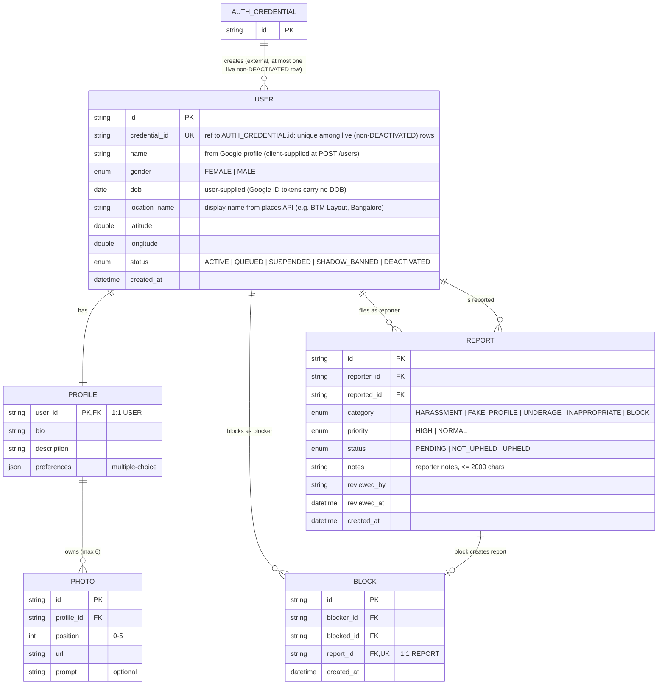
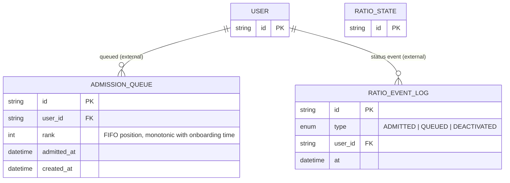
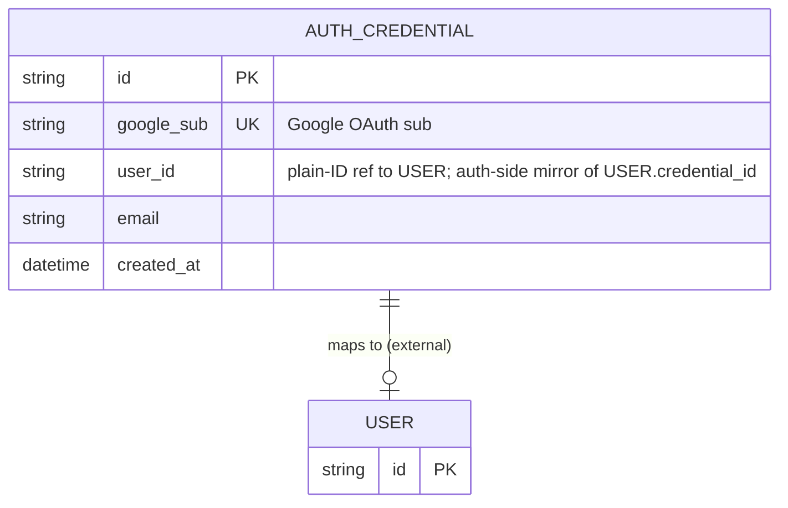
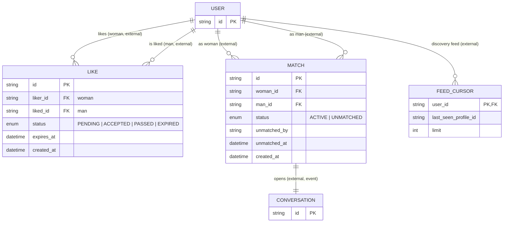
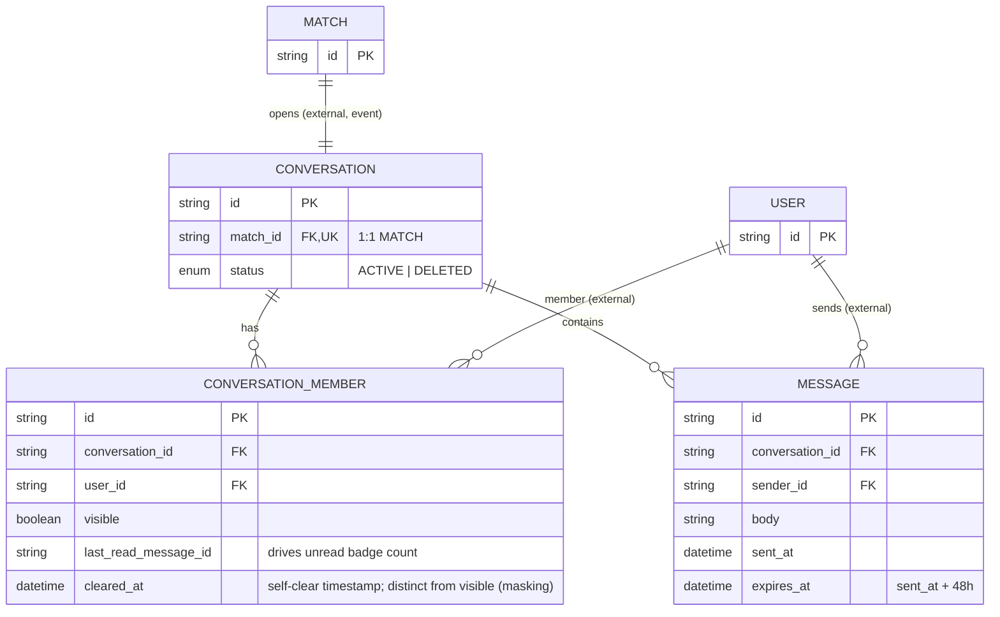
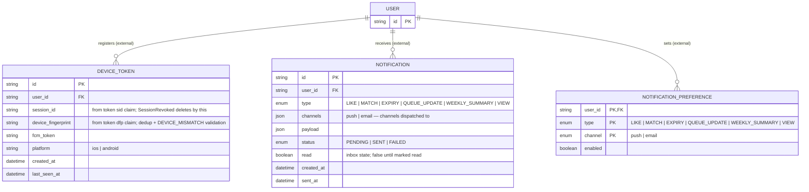
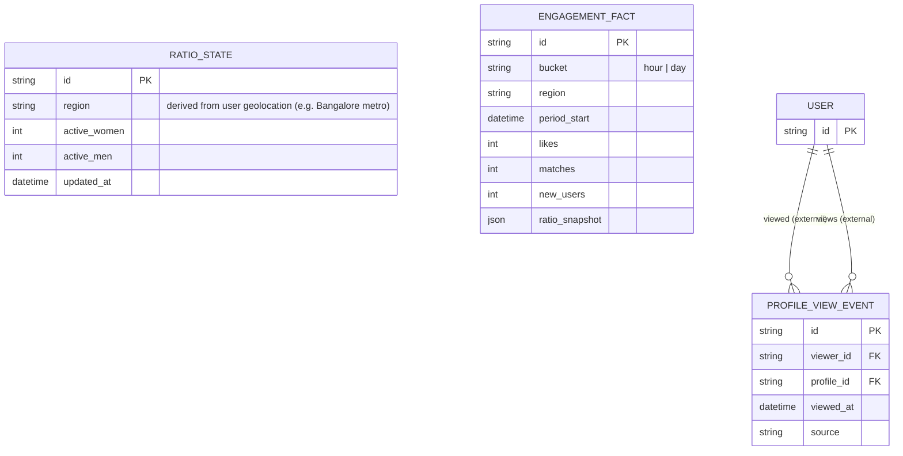

# Entity Relationship Diagram

```mermaid
erDiagram
    %% ============ NORTH: AUTH SERVICE ============
    AUTH_CREDENTIAL {
        string id PK
        string google_sub UK "Google OAuth sub"
        string user_id "plain-ID ref to USER; auth-side mirror of USER.credential_id"
        string email
        datetime created_at
    }

    %% ============ NORTHWEST: RATIO SERVICE ============
    ADMISSION_QUEUE {
        string id PK
        string user_id FK
        int rank "FIFO position, monotonic with onboarding time"
        datetime admitted_at
        datetime created_at
    }
    RATIO_EVENT_LOG {
        string id PK
        enum type "ADMITTED | QUEUED | DEACTIVATED"
        string user_id FK
        datetime at
    }

    %% ============ WEST: ANALYTICS SERVICE ============
    RATIO_STATE {
        string id PK
        string region "derived from user geolocation (e.g. Bangalore metro)"
        int active_women
        int active_men
        datetime updated_at
    }
    PROFILE_VIEW_EVENT {
        string id PK
        string viewer_id FK
        string profile_id FK
        datetime viewed_at
        string source
    }
    ENGAGEMENT_FACT {
        string id PK
        string bucket "hour | day"
        string region
        datetime period_start
        int likes
        int matches
        int new_users
        json ratio_snapshot
    }

    %% ============ CENTER: USER SERVICE ============
    USER {
        string id PK
        string credential_id UK "ref to AUTH_CREDENTIAL.id; unique among live (non-DEACTIVATED) rows"
        string name "from Google profile (client-supplied at POST /users)"
        enum gender "FEMALE | MALE"
        date dob "user-supplied (Google ID tokens carry no DOB)"
        string location_name "display name from places API (e.g. BTM Layout, Bangalore)"
        double latitude
        double longitude
        enum status "ACTIVE | QUEUED | SUSPENDED | SHADOW_BANNED | DEACTIVATED"
        datetime created_at
    }
    PROFILE {
        string user_id PK, FK "1:1 USER"
        string bio
        string description
        json preferences "multiple-choice"
    }
    PHOTO {
        string id PK
        string profile_id FK
        int position "0-5"
        string url
        string prompt "optional"
    }
    REPORT {
        string id PK
        string reporter_id FK
        string reported_id FK
        enum category "HARASSMENT | FAKE_PROFILE | UNDERAGE | INAPPROPRIATE | BLOCK"
        enum priority "HIGH | NORMAL"
        enum status "PENDING | NOT_UPHELD | UPHELD"
        string notes "reporter notes, <= 2000 chars"
        string reviewed_by
        datetime reviewed_at
        datetime created_at
    }
    BLOCK {
        string id PK
        string blocker_id FK
        string blocked_id FK
        string report_id FK, UK "1:1 REPORT"
        datetime created_at
    }

    %% ============ EAST: MATCHING SERVICE ============
    LIKE {
        string id PK
        string liker_id FK "woman"
        string liked_id FK "man"
        enum status "PENDING | ACCEPTED | PASSED | EXPIRED"
        datetime expires_at
        datetime created_at
    }
    MATCH {
        string id PK
        string woman_id FK
        string man_id FK
        enum status "ACTIVE | UNMATCHED"
        string unmatched_by
        datetime unmatched_at
        datetime created_at
    }
    FEED_CURSOR {
        string user_id PK, FK
        string last_seen_profile_id
        int limit
    }

    %% ============ SOUTHEAST: CHAT SERVICE ============
    CONVERSATION {
        string id PK
        string match_id FK, UK "1:1 MATCH"
        enum status "ACTIVE | DELETED"
    }
    CONVERSATION_MEMBER {
        string id PK
        string conversation_id FK
        string user_id FK
        boolean visible
        string last_read_message_id "drives unread badge count"
        datetime cleared_at "self-clear timestamp; distinct from visible (masking)"
    }
    MESSAGE {
        string id PK
        string conversation_id FK
        string sender_id FK
        string body
        datetime sent_at
        datetime expires_at "sent_at + 48h"
    }

    %% ============ SOUTH: NOTIFICATION SERVICE ============
    DEVICE_TOKEN {
        string id PK
        string user_id FK
        string session_id "from token sid claim; SessionRevoked deletes by this"
        string device_fingerprint "from token dfp claim; dedup + DEVICE_MISMATCH validation"
        string fcm_token
        string platform "ios | android"
        datetime created_at
        datetime last_seen_at
    }
    NOTIFICATION {
        string id PK
        string user_id FK
        enum type "LIKE | MATCH | EXPIRY | QUEUE_UPDATE | WEEKLY_SUMMARY | VIEW"
        json channels "push | email — channels dispatched to"
        json payload
        enum status "PENDING | SENT | FAILED"
        boolean read "inbox state; false until marked read"
        datetime created_at
        datetime sent_at
    }
    NOTIFICATION_PREFERENCE {
        string user_id PK, FK
        enum type PK "LIKE | MATCH | EXPIRY | QUEUE_UPDATE | WEEKLY_SUMMARY | VIEW"
        enum channel PK "push | email"
        boolean enabled
    }

    %% ============ RELATIONSHIPS (interleaved so dagre spreads N/S/E/W) ============

    %% North: Auth -> User
    AUTH_CREDENTIAL ||--o{ USER : "creates (review fix: retained DEACTIVATED rows + fresh live row — at most one live non-DEACTIVATED row per credential)"

    %% Northwest: Ratio -> User
    USER ||--o{ ADMISSION_QUEUE : "queued"
    USER ||--o{ RATIO_EVENT_LOG : "status event"

    %% West: Analytics -> User
    USER ||--o{ PROFILE_VIEW_EVENT : "viewed"
    USER ||--o{ PROFILE_VIEW_EVENT : "views"

    %% East: Matching -> User
    USER ||--o{ LIKE : "likes (woman)"
    USER ||--o{ LIKE : "is liked (man)"
    USER ||--o{ MATCH : "as woman"
    USER ||--o{ MATCH : "as man"
    USER ||--o{ FEED_CURSOR : "discovery feed"

    %% Southeast: Chat -> Matching/User
    MATCH ||--|| CONVERSATION : "opens"
    CONVERSATION ||--o{ CONVERSATION_MEMBER : "has"
    USER ||--o{ CONVERSATION_MEMBER : "member"
    CONVERSATION ||--o{ MESSAGE : "contains"
    USER ||--o{ MESSAGE : "sends"

    %% South: Notification -> User
    USER ||--o{ DEVICE_TOKEN : "registers"
    USER ||--o{ NOTIFICATION : "receives"
    USER ||--o{ NOTIFICATION_PREFERENCE : "sets"

    %% Center: User Service internal (kept last so they hug USER)
    USER ||--|| PROFILE : "has"
    PROFILE ||--o{ PHOTO : "owns (max 6)"
    USER ||--o{ REPORT : "files as reporter"
    USER ||--o{ REPORT : "is reported"
    USER ||--o{ BLOCK : "blocks as blocker"
    REPORT ||--o| BLOCK : "block creates report"
```

# user-service

Owns identity, profile, and moderation. CRUD for `USER`, `PROFILE`, `PHOTO`, `REPORT`, `BLOCK`. Reads `AUTH_CREDENTIAL` (created by Auth Service); applies `status` changes emitted by Ratio Service as events.

# ratio-service

Owns the male admission waitlist and ratio audit trail. CRUD for `ADMISSION_QUEUE`, `RATIO_EVENT_LOG`. Reads `RATIO_STATE` (owned by Analytics Service; raw counts only) to decide gate state; emits status events that User Service applies to `USER`.

# auth-service

Thin credential store. CRUD for `AUTH_CREDENTIAL`. Mints `AUTH_CREDENTIAL` on Google OAuth sign-in (fetching name and email from the Google account — ID tokens never carry DOB, review fix) and hands a `user_id` to User Service; never owns `USER`.

# matching-service

Owns discovery, likes, and matches. CRUD for `LIKE`, `MATCH`, `FEED_CURSOR`. Emits `match_created` events → Chat Service creates `CONVERSATION`.

# chat-service

Owns conversations, membership visibility, and per-message TTL. CRUD for `CONVERSATION`, `CONVERSATION_MEMBER`, `MESSAGE`. On `match_created` (Matching Service) creates a `CONVERSATION`; on unmatch, Matching flips `MATCH` to `UNMATCHED` and Chat tears down the thread.

# notification-service

Owns push delivery and device registration. CRUD for `DEVICE_TOKEN`, `NOTIFICATION`, `NOTIFICATION_PREFERENCE`. Consumes domain events (like, match, expiry, queue update) to enqueue push payloads.

# analytics-service

Reads domain events, owns aggregates and raw gender counts. CRUD for `RATIO_STATE`, `PROFILE_VIEW_EVENT`, `ENGAGEMENT_FACT`. `RATIO_STATE` (raw counts only, no gate state) is consumed read-only by Ratio Service; `PROFILE_VIEW_EVENT` powers "X women viewed your profile today" and women's like-delivery insights.

